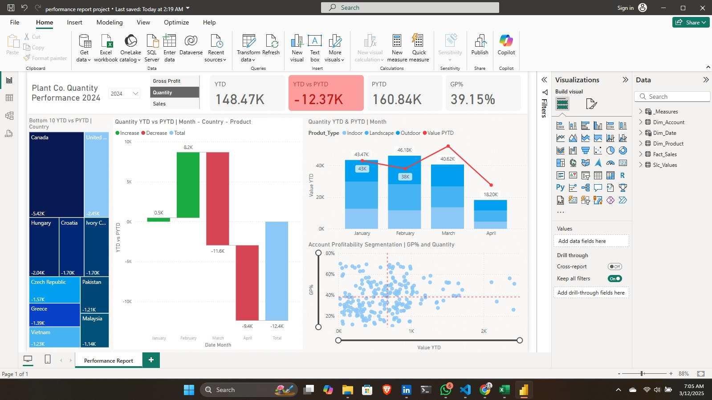

# Power-BI-Project
Built a condensed, dynamic performance report that utilizes switch measures and conditional formatting.
This dashboard is designed for performance analysis and decision-making regarding sales, quantity, and profitability trends across different countries, product types, and time periods.
Dashboard provides a performance report for Plant Co. in terms of Quantity, Sales, and Gross Profit, using year-to-date (YTD) and prior-year-to-date (PYTD) comparisons.

## Project Structure

1. Dataset: Dataset used is an excel with three tables: Plant_FACT, Accounts and Plant_Hierarchy.
   
2. Power Query and Virtual Tables: Power queries to rename tables (Plant_FACT to Fact_Sales, Accounts to Dim_Account, Plant_Hierarchy to Dim_Product) and clean data (removed duplicates in unique identifier columns).
  ```
   Create a table Dim_Date, Dim_Date = CALENDAR(Date(2022,1,1), Date(2024,12,31)). Add a new Column InPast in Dim_Date. InPast will have boolean value true/false based on last sales date. If date<= lastSalesDatePerYear, Impact is to true.
   Create a table Slc_Values which will be used within switch measure. Add a column Values with values Sales, Gross Profit and Quantity.
```

3. Model: Measures and Calculated Columns

   Create a table _Measures and add below base measures for switch.
   ```
   1. Sales = SUM(Fact_Sales(Sales_USD))
   2. Quantity = SUM(Fact_Sales(quantity))
   3. COGs = SUM(Fact_Sales(COGS_USD)) //required to calculate gross profit.
   4. Gross Profit = [Sales] - [COGs]
   5. PYTD_Sales = CALCULATE([Sales], SAMEPERIODLASTYEAR( Dim_Date[Date] ) , Dim_Date[InPast] = TRUE) //prior to date sales
   6. PYTD_Quantity = CALCULATE([Quantity], SAMEPERIODLASTYEAR( Dim_Date[Date] ) , Dim_Date[InPast] = TRUE) //prior to date quantity
   7. PYTD_GrossProfit = CALCULATE([Gross Profit], SAMEPERIODLASTYEAR( Dim_Date[Date] ) , Dim_Date[InPast] = TRUE) //prior to date sales
   8. YTD_Sales = TOTALYTD([Sales], Fact_Sales[Date_Time]) //Year To date Sales
   9. YTD_Quantity = TOTALYTD([Quantity], Fact_Sales[Date_Time]) //Year To date quantity
   10. YTD_GrossProfit = TOTALYTD([Gross Profit], Fact_Sales[Date_Time]) //Year To date Sales
   // create two measures for switches.
   11. S_PYTD =
         VAR selected_value = SELECTEDVALUE(Slc_Values[Values])
         VAR result = SWITCH(selected_value,
             "Sales", [PYTD_Sales],
             "Quantity", [PYTD_Quantity],
             "Gross Profit", [PYTD_GrossProfit],
             BLANK()
          )
         RETURN result
   12. S_YTD =
         VAR selected_value = SELECTEDVALUE(Slc_Values[Values])
         VAR result = SWITCH(selected_value,
             "Sales", [YTD_Sales],
             "Quantity", [YTD_Quantity],
             "Gross Profit", [YTD_GrossProfit],
             BLANK()
          )
         RETURN result
   ```
   
6. Visuals: Layout and Design


## Dashboard Interpretation
1. KPIs
   
YTD Quantity: 148.47K (current year total quantity)
YTD vs PYTD Difference: -12.37K (indicates decline in quantity)
PYTD Quantity: 160.84K (last year’s total at the same time)
GP% (Gross Profit Percentage): 39.15% (profitability indicator)

3. Visuals
   
-> TreeMap (Bottom 10 Countries - YTD vs PYTD): Shows the lowest-performing countries in terms of quantity decrease. Canada, Hungary, and Croatia have the highest declines.
-> Bar Chart (Quantity YTD vs PYTD by Month): Green bars indicate increase, red bars indicate decrease. March had the biggest negative impact (-11.6K units).
->Stacked Column & Line Chart (Product Type Performance by Month):
   Blue bars: YTD Quantity for different product types.
   Red line: PYTD comparison.
   Drop in April suggests a decline in demand.
-> Scatter Plot (GP% vs Quantity Segmentation): Identifies profitable vs low-margin accounts. Helps segment customers based on profitability.
   
## Conclusion
This dashboard allows business users to: 
1. Monitor overall performance (YTD vs PYTD).
2. Analyze trends across regions, months, and product types.
3. Optimize sales & profitability strategies by identifying weak spots.
